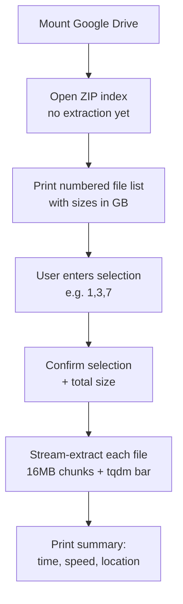

<div align="center">

# ⚡ ZipSieve

### Selective ZIP Extractor for Google Colab

Stop unpacking entire multi-GB archives just to grab one file. Peek inside a ZIP, pick exactly what you need, and stream it straight to Google Drive — with live progress bars and speed stats.

[](https://www.python.org/)
[](https://colab.research.google.com/)
[](https://github.com/tqdm/tqdm)
[](LICENSE)
[](#)
[](#-contributing)

</div>

---

## ✨ Features

| | |
|---|---|
| 📂 **Peek before you extract** | Lists every file inside the archive — with size in GB — before anything is unpacked |
| 🎯 **Selective extraction** | Extract only the files you choose (`1,3,7`) instead of the whole archive |
| 📊 **Live progress bars** | Per-file `tqdm` bars with byte counts, speed, and ETA |
| 🧩 **Chunked streaming reads** | Reads in 16 MB chunks so multi-GB files never get fully loaded into RAM |
| 📁 **Preserves folder structure** | Nested directories inside the ZIP are recreated automatically in the output |
| ⚡ **Speed & timing stats** | MB/s and elapsed time per file, plus a full run summary at the end |
| 🔗 **Google Drive native** | Built-in Drive-mount cell, output written directly into `MyDrive` |
| 🪶 **Zero extra setup** | Only dependency is `tqdm`, which ships preinstalled on Colab |

---

## 🧠 How It Works



1. **Mount Drive** — `drive.mount("/content/drive")` connects your Google Drive to the Colab runtime.
2. **Index the archive** — `zipfile.ZipFile` opens the ZIP and reads its *table of contents* only — nothing is extracted yet, so even a 100 GB archive opens instantly.
3. **Browse contents** — every file inside is printed with an index number and its size in GB, so you can see what's there before committing to anything.
4. **Select files** — you type a comma-separated list of indices (e.g. `1,3,7`); invalid numbers are skipped with a warning instead of crashing the run.
5. **Confirm selection** — the script recaps exactly what you picked and the combined size, so there are no surprises.
6. **Stream-extract** — each selected file is copied in 16 MB chunks straight from the ZIP to disk, updating a live `tqdm` progress bar as it goes. This keeps memory usage flat regardless of file size.
7. **Wrap up** — a final report shows total files extracted, total data moved, total time, and the output folder.

---

## 🚀 Quick Start

Run the two cells in order inside a Colab notebook:

```python
# Cell 1 — Mount Drive
from google.colab import drive
drive.mount("/content/drive")
```

```python
# Cell 2 — Extract
ZIP_FILE = "/content/drive/MyDrive/your_archive.zip"   # 👈 point this at your ZIP
OUTPUT_DIR = "/content/drive/MyDrive/extracted"          # 👈 where files land

# ...run the extractor cell — it will list contents and prompt you for a selection
```

You'll be prompted in-cell:

```
🎯 Enter file numbers to extract (example: 1,3,7):
```

---

## ⚙️ Configuration

| Variable | Description | Default |
|---|---|---|
| `ZIP_FILE` | Path to the source `.zip` on Drive | *(set this — must point to a file, not a folder)* |
| `OUTPUT_DIR` | Destination folder for extracted files | `/content/drive/MyDrive` |
| `CHUNK_SIZE` | Bytes read per chunk during streaming | `16 * 1024 * 1024` (16 MB) |

> ⚠️ **Heads up:** `ZIP_FILE` must point directly at the `.zip` file itself (e.g. `.../MyDrive/data.zip`), not a directory.

---

## 📋 Requirements

- Google Colab (or any Jupyter environment with `google.colab` available)
- Python 3.8+
- [`tqdm`](https://pypi.org/project/tqdm/) — preinstalled on Colab; elsewhere: `pip install tqdm`

---

## 📁 Suggested Repo Structure

```
zipsieve/
├── zipsieve.ipynb        # the Colab notebook (Drive mount + extractor cells)
├── README.md
└── LICENSE
```

---

## 🤝 Contributing

Issues and PRs are welcome — ideas like a non-interactive/CLI mode, wildcard/regex file selection, or a checksum-verification step would all be great additions.

## 📄 License

Released under the [MIT License](LICENSE).

</div>
